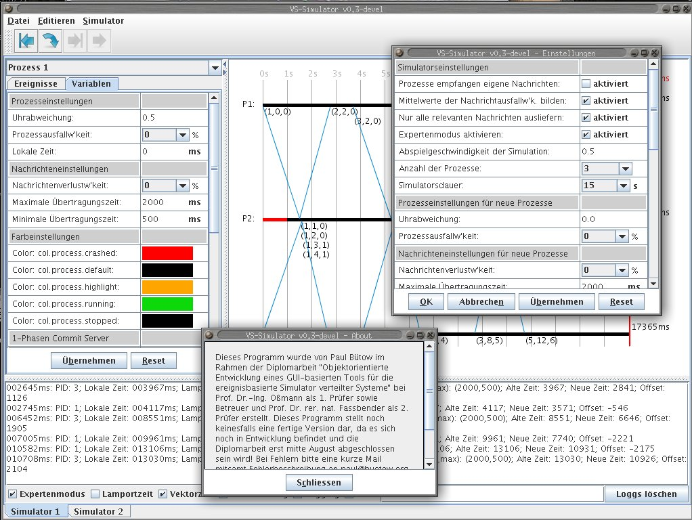

vs-sim
======

VS-Sim is an open source simulator programmed in Java for distributed systems. VS-Sim stands for "Verteilte Systeme Simulator" which is the german translation for "Distributed Sytstems Simulator". The VS-Sim project was my diploma thesis at the Aachen University of Applied Sciences.

